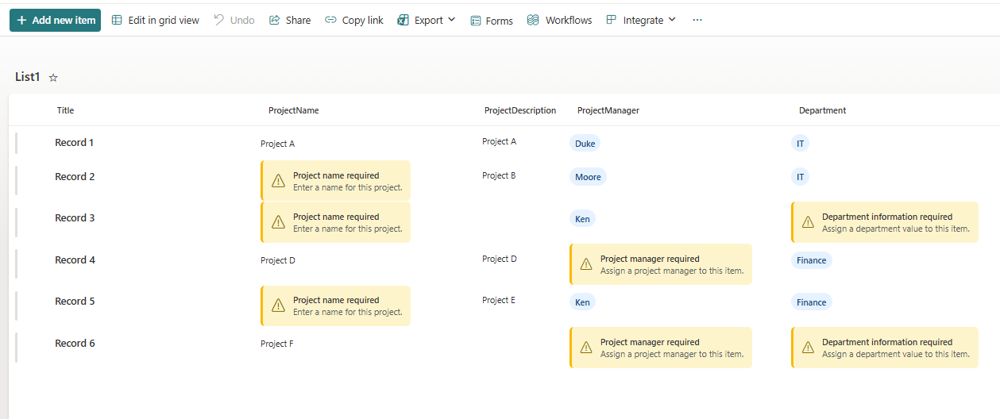

# Missing Information Callout

## Summary

The Missing Information Callout column formatter provides a clear, accessible visual indicator when a SharePoint list column contains no value. Rather than displaying an empty cell, the formatter presents a Fluent UI-inspired callout with a warning icon, title, and supporting message, helping users quickly identify incomplete records.

The formatter is designed to improve data quality by making missing information immediately visible without requiring additional validation rules, Power Automate flows, or custom development.



## Features

- Displays a prominent callout when the target field is empty.
- Automatically hides the callout when a value exists.
- Fluent UI-inspired styling using native SharePoint formatting capabilities.
- Lightweight JSON with no external dependencies.
- Accessible design using both iconography and descriptive text.
- Fully client-side rendering with no impact on list data.
- Easily adapted for different field types and business scenarios.
- Suitable for modern SharePoint Online lists and libraries.

## View Requirements

This formatting requires the following **column in your SharePoint list**:

|Column|Type|Required|
|------|----|--------|
|Target Column|Any supported column type*|Yes|

**Note**
The supplied sample is intended for text-based fields. When formatting other column types (such as Person, Lookup, Choice, Hyperlink, or Managed Metadata), the expression used to determine whether the field is empty may need to be adjusted.

## JSON Column Formatting Features

The JSON formatting includes several advanced visual features:

- Conditional rendering using SharePoint expression syntax.
- Fluent UI warning icon (Warning).
- Flexible layout using CSS Flexbox.
- Visual emphasis through a coloured left border.
- Rounded corners for a modern appearance.
- Responsive spacing and typography.
- Automatic hiding when the field contains a value.
- Clean separation between title and descriptive text.
- Native SharePoint JSON formatting only - no JavaScript or custom CSS required.

## How to Apply

1. Open the SharePoint list.
2. Select the column you want to format.
3. Open the column menu.
4. Select **Column settings > Format this column**.
5. Switch to **Advanced mode**.
6. Replace the existing JSON with the contents of this sample.
7. Save the formatting.

The formatter immediately evaluates the value of the current field.

- If the field is empty, the warning callout is displayed.
- If the field contains a value, the formatter is hidden and the cell displays normally.

## How It Works

The formatter evaluates the current column using a conditional expression.

```json

If field is empty
    Display warning callout

Else
    Hide formatter

```

The layout is constructed using nested div elements with Flexbox, providing consistent alignment across modern SharePoint experiences.

The warning icon is rendered using the built-in Fluent UI icon set via the iconName attribute.

## Customization Options

The sample has been designed for easy customization.

### Change the title

```json

"txtContent": "Missing information"

```

Example: *Owner Required*

### Change the message

```json

"txtContent": "This field has not been completed."

```

Example: *Assign a project owner before work begins.*

### Change the icon

Replace:

```json

"iconName": "Warning"

```

Examples:

|Icon|Purpose|
|----|-------|
|Info|Informational message|
|Completed|Success state|
|ErrorBadge|Validation error|
|Blocked|Mandatory field|
|ReminderPerson|Missing owner|
|Calendar|Missing date|

### Adjust spacing

The appearance can be refined by modifying:

- padding
- gap
- border-radius
- font-size
- line-height

These properties allow the formatter to match your organisation's preferred visual style.

## Notes

- This formatter only changes the visual presentation of the column.
- It does not enforce required fields or perform data validation.
- Existing column values remain unchanged.
- Users can continue to edit items using standard SharePoint forms.

## Sample

|Solution|Author(s)|
|--------|---------|
|generic-missing-information-callout.json|[Josiah Opiyo](https://github.com/ojopiyo)|

## Version History

|Version|Date|Comments|
|-------|----|--------|
|1.0|July 12, 2026|Initial release|

## Disclaimer
**THIS CODE IS PROVIDED *AS IS* WITHOUT WARRANTY OF ANY KIND, EITHER EXPRESS OR IMPLIED, INCLUDING ANY IMPLIED WARRANTIES OF FITNESS FOR A PARTICULAR PURPOSE, MERCHANTABILITY, OR NON-INFRINGEMENT.**

## References

- [SharePoint Column Formatting Documentation](https://learn.microsoft.com/sharepoint/dev/declarative-customization/column-formatting)
- [JSON Schema for SharePoint Column Formatting](https://developer.microsoft.com/json-schemas/sp/v2/column-formatting.schema.json)


